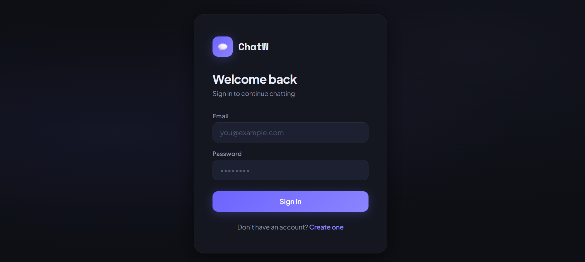
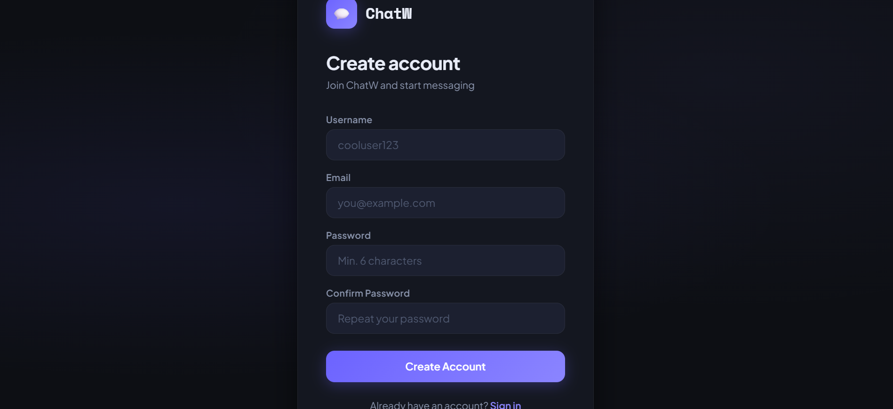
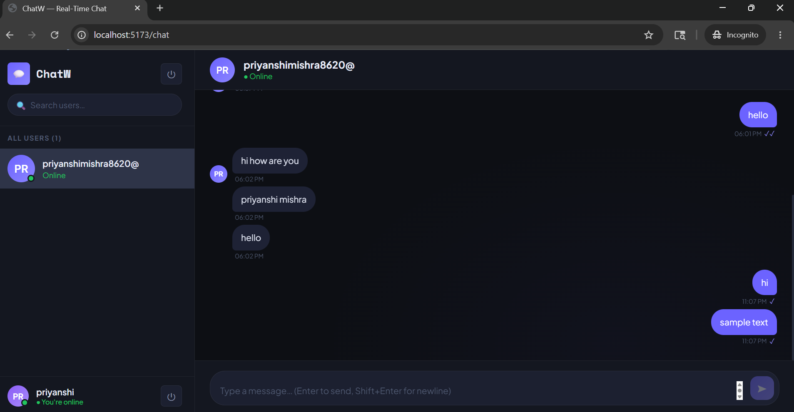
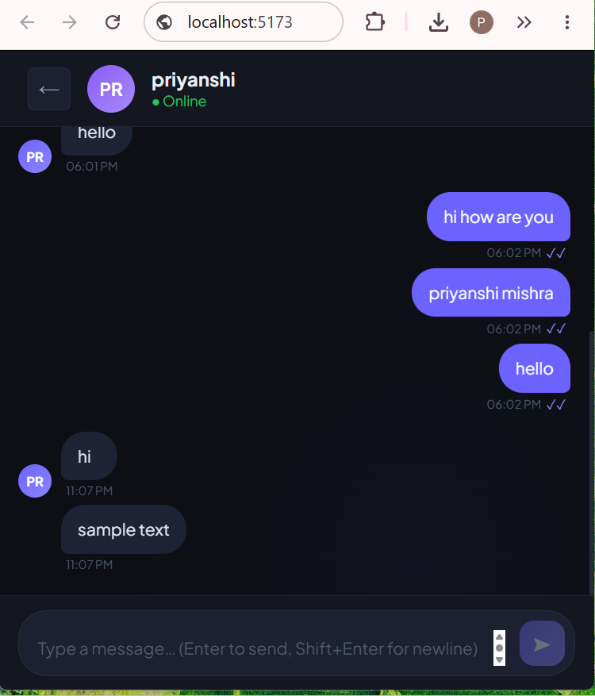

# ChatW — Real-Time Chat Application 💬

ChatW is a modern full-stack real-time messaging platform built using React, Node.js, Express.js, Socket.io, and MongoDB.

It enables users to authenticate securely, exchange instant messages in real time, track online users, and experience seamless communication through a responsive modern UI.

---

## ✨ Features

- 🔐 JWT Authentication & Authorization
- 💬 Real-Time Messaging with Socket.io
- 🟢 Online/Offline User Tracking
- ✍️ Typing Indicators
- 📩 Unread Message Tracking
- 📱 Fully Responsive UI
- ⚡ Instant Message Delivery
- 🔒 Password Hashing using bcrypt
- 🗂 MongoDB Data Persistence

---

## 🛠 Tech Stack

### Frontend
- React
- Vite
- Context API
- Axios
- Socket.io-client
- CSS

### Backend
- Node.js
- Express.js
- MongoDB
- Mongoose
- JWT
- bcrypt
- Socket.io

---

## 📂 Folder Structure

```txt
chatw/
├── backend/
│   ├── config/
│   │   └── db.js
│   ├── controllers/
│   │   ├── authController.js
│   │   └── messageController.js
│   ├── middleware/
│   │   └── authMiddleware.js
│   ├── models/
│   │   ├── User.js
│   │   └── Message.js
│   ├── routes/
│   │   ├── authRoutes.js
│   │   └── messageRoutes.js
│   ├── socket/
│   │   └── socket.js
│   ├── .env
│   ├── package.json
│   └── server.js
│
└── frontend/
    ├── src/
    │   ├── context/
    │   │   ├── AuthContext.jsx
    │   │   └── SocketContext.jsx
    │   ├── pages/
    │   │   ├── Login.jsx
    │   │   ├── Signup.jsx
    │   │   └── Chat.jsx
    │   ├── components/
    │   │   ├── Sidebar.jsx
    │   │   ├── ChatBox.jsx
    │   │   ├── Message.jsx
    │   │   └── InputBox.jsx
    │   ├── App.jsx
    │   ├── main.jsx
    │   └── index.css
    ├── index.html
    ├── package.json
    └── vite.config.js
```

---

## 📸 Screenshots

### 🔐 Login Page


### 📝 Signup Page


### 💬 Chat Dashboard


### 📱 Responsive UI


---

## ⚙️ Prerequisites

Make sure you have the following installed:

- Node.js v18+
- MongoDB Community Server

Install MongoDB:  
https://www.mongodb.com/try/download/community

Start MongoDB locally:

```bash
mongod
```

or run it through MongoDB Compass.

---

## 🚀 Setup & Run

### 1️⃣ Clone Repository

```bash
git clone https://github.com/YOUR_USERNAME/ChatW-Real-Time-Chat-App.git
```

---

### 2️⃣ Backend Setup

```bash
cd chatw/backend
npm install
```

Create a `.env` file inside the backend folder:

```env
PORT=5000
MONGO_URI=your_mongodb_connection_string
JWT_SECRET=your_secret_key
```

Start backend server:

```bash
npm run dev
```

Backend runs on:

```txt
http://localhost:5000
```

---

### 3️⃣ Frontend Setup

Open a new terminal:

```bash
cd chatw/frontend
npm install
npm run dev
```

Frontend runs on:

```txt
http://localhost:5173
```

---

## 🧪 Testing the Application

1. Open two browser windows (or use incognito mode)
2. Register two separate accounts
3. Select another user from sidebar
4. Send messages in real time
5. Observe typing indicators
6. Check online/offline status updates instantly

---

## 🔌 API Endpoints

| Method | Route | Auth | Description |
|--------|-------|------|-------------|
| POST | /api/auth/register | No | Register new user |
| POST | /api/auth/login | No | Login and receive JWT |
| GET | /api/auth/me | Yes | Current logged-in user |
| GET | /api/auth/users | Yes | Get all users except self |
| POST | /api/messages/send/:id | Yes | Send message |
| GET | /api/messages/:userId | Yes | Fetch conversation |
| GET | /api/messages/unread/counts | Yes | Get unread counts |

---

## ⚡ Socket Events

| Event | Direction | Payload |
|-------|-----------|---------|
| onlineUsers | Server → All | string[] (userIds) |
| newMessage | Server → Room | Message object |
| typing | Client → Server | { receiverId } |
| stopTyping | Client → Server | { receiverId } |
| userTyping | Server → Receiver | { senderId } |
| userStoppedTyping | Server → Receiver | { senderId } |
| markRead | Client → Server | { senderId } |
| messagesRead | Server → Sender | { readBy } |

---

## 🔄 Real-Time Communication Flow

1. User logs in securely
2. Socket.io connection is established
3. Online users are broadcasted instantly
4. Messages are emitted in real time
5. Receiver gets instant updates without refresh
6. Messages are stored in MongoDB
7. Typing indicators update dynamically

---

## 🚀 Future Improvements

- 👥 Group Chats
- 📞 Voice & Video Calling
- 😀 Emoji Reactions
- 📎 File & Media Sharing
- 🔔 Push Notifications
- 🔐 End-to-End Encryption

---

## 🌐 Deployment

### Frontend
Deploy using:
- Vercel
- Netlify

### Backend
Deploy using:
- Render
- Railway

---

## 👩‍💻 Author

Priyanshi Mishra

---

## ⭐ Support

If you liked this project, consider giving it a ⭐ on GitHub!